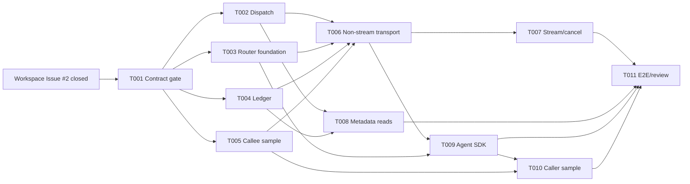

# Implementation Plan: Invocation Routing and Ledger

**Branch**: `codex/010-invocation-routing-ledger` | **Date**: 2026-07-16 | **Spec**: [spec.md](spec.md)

**Input**: Backend `Invoke -> Record` planning after Spec 009 Workspace acceptance.

## Summary

Deliver the backend half of the remaining Phase 1 loop through one parent task
and eleven dependency-ordered child issues. The Control Plane adds Invocation
Dispatch and Gateway forwarding; the independent A2A Router owns controlled
exact resolution, A2A transport, cancellation/deadline handling, transient
result forwarding, append-only Ledger events, and metadata reads. A thin Agent
SDK and two different Runtime samples prove one nested call and lineage.

Workspace parent Issue #2 is closed after PR #18 merged with green project
closure CI jobs and a fresh independent review. The plan starts with a
contract/design gate because the existing active
contracts do not yet define an Agent-SDK-facing Router entry point, credential
binding for non-`none` Agent authentication, or complete Ledger-write failure
semantics. Runtime implementation must not guess those policies.

## Technical Context

**Language/Version**: Go 1.26 for Control Plane, Router, Ledger, SDK, and the
direct A2A sample; an isolated second Runtime sample selected and pinned by its
child Spec without becoming a core dependency.

**Primary Dependencies**: Go `net/http`; `github.com/a2aproject/a2a-go`
`v0.3.15`; `pgx/v5`; existing language-neutral JSON Schema/OpenAPI/A2A Profile
validators. A full Agent Runtime dependency is permitted only under
`agents/` for the second sample.

**Storage**: PostgreSQL 17 with a Router/Ledger-owned schema, append-only event
table, and transactionally maintained read projection. No Agent input, result,
chunk, credential, or raw dependency detail is stored.

**Testing**: Go unit and contract tests; `httptest`; real PostgreSQL integration
tests under the existing integration tag; A2A conformance corpus; Compose;
cross-process E2E with two sample Agents; race, vet, build, and diff checks.

**Target Platform**: Linux containers and local Docker Compose, with Windows
PowerShell-compatible development commands.

**Project Type**: Multi-process platform backend with a Go Control Plane, a
separate Go A2A Router, a Go SDK, and isolated sample Agent processes.

**Performance Goals**: Preserve correct isolation, ordering, and one terminal
outcome across 100 concurrent accepted invocations. No latency or throughput
SLO is invented in this feature.

**Constraints**: Gateway-only northbound access; Router-only managed Agent
transport; exact Workspace authorization before dispatch and controlled exact
resolution at Router time; same-request JSON/SSE result delivery; no result
persistence/replay; metadata-only Ledger; explicit required configuration;
fallback addition budget zero.

**Scale/Scope**: One Control Plane process, one Router process, one PostgreSQL
instance with logical schema ownership, two sample Agents, root and one-level
or deeper nested calls, and 100-request deterministic concurrency evidence.

## Baseline and Blockers

| Area | Current fact | Planning impact |
| --- | --- | --- |
| Catalog | Durable Register/Publish/Discover/Disable exists | Reuse exact published Card facts through owned ports only |
| Workspace | Create, install, lifecycle, inspection, and exact internal resolution exist | Dispatch may consume a narrow Workspace authorization port; Router uses internal resolution |
| Workspace closure | PR #18 merged, closure CI jobs green, Issue #2 closed | Satisfied; T001 is the active gate |
| Invocation contracts | Active Northbound v3, Router Internal v2, result/event/error schemas exist | Reuse as starting point; contract gate resolves runtime gaps before code |
| Router | No process, config, handler, client, or deployment exists | New independent deployment unit |
| Ledger | No schema, store, event appender, projection, or read path exists | New Router-owned durable module |
| SDK/sample Agents | No SDK or live Agent process exists | New isolated packages/processes |
| Frontend | Paused | Excluded from this parent |

## Constitution Check

*GATE: Passed for parent planning. Runtime children remain blocked until the
contract gate and Workspace closure pass. Re-check after every child design.*

- **Phase 1 loop - PASS**: The parent directly delivers `Invoke -> Record`.
- **Ownership - PASS**: Dispatch stays in Control Plane; Router and Ledger own
  data-plane execution/facts; Router reads Control Plane facts only through the
  versioned internal API.
- **Runtime independence - PASS**: Core depends on A2A protocol facilities, not
  a full Agent Runtime. Runtime-specific dependencies stay under `agents/`.
- **Contracts - CONDITIONAL PASS**: Active contracts are the source of truth;
  T001 must freeze the missing SDK/credential/failure policies before runtime.
- **Invocation lineage - PASS**: Root, parent, task, and trace identifiers are
  first-class across Dispatch, Router, SDK, result, and Ledger paths.
- **Failure safety - PASS**: No fallback, replay, stale Card, direct route,
  retry, default endpoint, default secret, or degraded success is planned.
- **SDD traceability - PASS**: Every child runs its own Spec through Converge;
  the parent acceptance maps all FRs and verifies the integrated graph.
- **Cross-runtime proof - PASS**: Two different Runtime implementations and one
  Router-mediated nested call are mandatory parent acceptance.

## Architecture

```text
Caller
  -> Gateway (auth, strict request/mode validation, root correlation)
  -> Invocation Dispatch (Workspace authorization, exact pin)
  -> Router Internal API (explicit service auth)
  -> Router
       -> Ledger append: created/routing
       -> Control Plane Internal API: exact re-resolution
       -> A2A transport: message/send or message/stream
       -> Ledger append + projection: started/stream/terminal
       -> transient JSON or SSE result
  -> Gateway forwards the live result

Agent A
  -> thin Agent SDK (validates inherited platform context)
  -> SDK-facing Router boundary frozen by T001
  -> Router creates child Invocation
  -> same resolution, transport, and Ledger path
  -> Agent B
```

### Ownership

| Component | Owns | Must not own |
| --- | --- | --- |
| Gateway | Authentication, strict HTTP/media boundary, root Trace/Invocation/Task generation, response forwarding | Agent transport, Card storage, Ledger rows |
| Invocation Dispatch | Pre-dispatch Workspace authorization and Router client orchestration | A2A transport, Router schema, permanent Card copy |
| Workspace | Installation and accepted-permission facts; exact authorization | Invocation events, Agent transport |
| Router | Internal dispatch boundary, controlled re-resolution, task context, A2A transport, deadline/cancel propagation | Catalog/Workspace tables or permanent Card source |
| Ledger | Append-only events and derived Invocation/Trace read projection | Routing or authorization decisions, result content |
| Agent SDK | Context validation/propagation and nested Router calls | Models, tools, workflows, memory, general runtime execution |
| Sample Agents | Deterministic Agent behavior and Runtime-specific adapters | Platform policy or shared internal platform types |

## Dispatch and Result Flow

1. Gateway authenticates the caller and strictly validates path, body,
   `stream`, and `Accept`. Pre-context failures carry only safe Trace data.
2. Gateway creates root `invocation_id`, `root_task_id`, and `trace_id` only for
   a request that can enter Invocation Dispatch.
3. Dispatch calls a narrow Workspace authorization port with trusted caller,
   Workspace, Agent, and capability. The port returns the exact enabled pin or
   a typed policy/dependency failure.
4. Dispatch sends the active Router request with the exact pin and unchanged
   correlation. It never addresses the Agent endpoint.
5. Router durably appends `created` before an Agent side effect, appends
   `routing`, and calls the separately authenticated Control Plane resolution
   API using the same exact identifiers/version/capability.
6. Router validates the resolved Card/Profile and performs the supported A2A
   operation. It maps protocol Task states without using Runtime internals.
7. Ledger append and projection update occur in one database transaction per
   lifecycle event. A successful result/terminal response is not emitted until
   its terminal Ledger fact is committed.
8. Non-streaming mode returns one result. Streaming mode returns ordered live
   result events; Ledger stream facts store only chunk index and byte count.
9. HTTP disconnect, deadline, and cancellation propagate to A2A cancellation
   where the active profile permits it. First valid terminal wins.
10. Gateway forwards the Router response without buffering a complete stream
    and without persisting result data.

The successful Router `created` commit is the accepted-Invocation boundary.
Failures before it may carry safe generated/request correlation according to
the active contract, but create no Ledger fact.

### Ledger Failure Rule

- If the initial `created` append fails, Router does not call the Agent and
  returns an explicit dependency failure.
- If a later non-terminal append fails before another Agent side effect, Router
  stops and returns/finalizes dependency failure where the response state
  permits.
- A clean success is emitted only after the matching terminal fact commits.
- Storage loss after an external Agent side effect can leave a durable
  non-terminal audit trail; Phase 1 does not hide it as success or invent a
  retry/reconciliation loop. T001 must freeze the exact public/operational
  visibility of that interrupted state before Ledger implementation.
- Route, credential, and exact-resolution failures terminalize from `routing`;
  cancellation/timeout may terminalize from `pending`, `routing`, or `running`.
  Only `running` may transition to `succeeded`.

## Planned Project Structure

```text
apps/
|-- control-plane/
|   |-- internal/gateway/invocation_handler.go
|   `-- internal/invocation/
|       |-- model.go
|       |-- service.go
|       `-- router_client.go
`-- a2a-router/
    |-- Dockerfile
    |-- cmd/a2a-router/main.go
    |-- internal/api/
    |-- internal/config/
    |-- internal/routing/
    |-- internal/taskcontext/
    |-- internal/transport/a2a/
    `-- internal/ledger/postgres/

contracts/
|-- openapi/
|-- schemas/
|-- invocation/
`-- a2a-profile/

sdks/agent-sdk/
agents/runtime-a/
agents/runtime-b/
tests/integration/invocation/
tests/e2e/invoke-record/
deploy/compose.yaml
specs/010-invocation-routing-ledger/
```

**Structure Decision**: Preserve the existing monorepo and add the Router as a
separate Go deployment unit. Keep domain packages under their owning process;
only language-neutral contracts and the thin SDK cross those boundaries.

## Contract Gate Decisions

T001 must resolve and version, when necessary, these issues before T002-T010:

1. Define the authenticated Agent-SDK-to-Router nested invocation surface. Do
   not silently reuse a Control-Plane-only internal API.
2. Define the Phase 1 credential-binding policy for Agent Card authentication
   types. A Card never contains a secret; unsupported types must have an exact
   visible outcome rather than an empty credential or direct unauthenticated
   attempt.
3. Freeze Ledger append/projection transaction rules and the visible outcome
   when storage fails after an Agent side effect.
4. Freeze explicit deadline configuration, HTTP disconnect cancellation,
   A2A `tasks/cancel` mapping, and first-terminal-wins race behavior.
5. Verify request/response size limits, SSE flushing/framing, correlation, and
   error mapping across Northbound, Router, SDK, and Ledger reads.
6. Decide whether an active contract version is sufficient or a breaking
   version increment/migration note is required. Historical runtime fallback
   remains prohibited.

## Child Issue Plan

| Task | Child issue scope | Blocked by | Can run in parallel with | Primary write scope |
| --- | --- | --- | --- | --- |
| T001 | Freeze Invocation/Router/Ledger/SDK contract and failure policy | None; Issue #2 is closed | None | `specs/011-*`, `contracts/`, ADR/docs |
| T002 | Implement Control Plane Invocation Dispatch and Gateway result proxy | T001 | T003, T004, T005 | `apps/control-plane/internal/invocation/`, Gateway invocation files, config wiring |
| T003 | Build Router process, strict config/internal auth, and Control Plane resolution client | T001 | T002, T004, T005 | Router `cmd`, `internal/config`, `internal/auth`, `internal/resolution`, Dockerfile |
| T004 | Implement Router-owned append-only Ledger, projection, migrations, and internal reads | T001 | T002, T003, T005 | `apps/a2a-router/internal/ledger/` and Ledger-specific handler |
| T005 | Build direct A2A callee sample and conformance evidence | T001 | T002, T003, T004 | `agents/runtime-b/` and sample fixtures |
| T006 | Deliver non-streaming exact A2A dispatch and transient result | T002, T003, T004, T005 | T008 | Router transport/routing integration |
| T007 | Deliver streaming, deadline, cancellation, and terminal race behavior | T006 | T009 after T006 | Router streaming/task-context transport |
| T008 | Expose authorized Northbound Invocation and Trace metadata reads | T002, T004 | T006, T007 | Control Plane Gateway/read proxy and focused tests |
| T009 | Deliver thin Agent SDK and authenticated nested Router calls | T001, T003, T006 | T007, T008 | `sdks/agent-sdk/`, Router agent-facing handler, and nested adapter |
| T010 | Build second-Runtime caller sample using SDK and nested call | T005, T009 | None after its blockers | `agents/runtime-a/` and isolated Runtime adapter |
| T011 | Run cross-process backend E2E, failure/concurrency matrix, independent Review, and Converge | T007, T008, T009, T010 | None | `tests/e2e/invoke-record/`, Compose/CI, handoff |

## Dependency and Parallelism



- **Global blocker**: T001 must freeze the missing policy before T002-T010.
- **Parallel batch A (max 4)**: T002, T003, T004, and T005 have disjoint
  ownership after T001.
- **Parallel batch B (max 2)**: T006 and T008 can proceed together when their
  separate prerequisites are complete.
- **Parallel batch C (max 3)**: T007, T008 if unfinished, and T009 can overlap
  after non-stream transport is stable; their write scopes remain separate.
- **Sequential integration**: T010 needs SDK plus the callee; T011 waits for all
  required runtime slices and is the only parent closure gate.

Stable maximum implementation parallelism is four. Higher concurrency would
create avoidable shared writes in contracts, Router wiring, Compose, or CI.

## Delivery Strategy

1. Complete T001 as a documentation/contract gate, including compatibility and
   fallback inventory, before runtime code changes.
2. Run parallel batch A and merge each slice only after its independent review.
3. Deliver one non-streaming root invocation first (T006) as the backend MVP;
   validate exact result plus durable terminal facts.
4. Add metadata reads in parallel, then streaming/cancel and SDK nested calls.
5. Add the second Runtime caller only against the frozen SDK/Router surface.
6. Execute T011 against real processes/PostgreSQL, review independently, append
   Converge tasks for every gap, and close the parent only when the graph is
   complete.

## Verification Gates

- Contract schemas, OpenAPI, semantic corpora, and Go mappings validate with no
  historical runtime fallback.
- Control Plane unit/HTTP tests prove auth, media mode, correlation generation,
  Workspace policy, Router-only dispatch, and error mapping.
- Router unit/integration tests prove strict config, separate internal auth,
  controlled resolution, endpoint/profile validation, and transport semantics.
- Ledger PostgreSQL tests prove append-only enforcement, unique sequence/event
  identity, transactionally updated projection, restart durability, query
  isolation, and content exclusion.
- A2A tests execute all active profile operations and invalid corpus cases.
- SDK tests reject missing/malformed context and never synthesize caller,
  Workspace, route, or correlation.
- E2E proves root JSON, root SSE, nested cross-Runtime call, 100 concurrent
  invocations, failure matrix, timeout/cancel, restart reads, and zero persisted
  content.
- Independent Review and Converge complete after all implementation/tests.

## Post-Design Constitution Check

- Control/Data Plane ownership remains unchanged and process-direction contracts
  are explicit.
- The only planned persistent facts are Router/Ledger-owned metadata.
- The SDK and samples cannot introduce Runtime behavior into core packages.
- Contract gaps are blocking tasks, not guessed fallback behavior.
- The issue graph includes tests after implementation, independent Review, and
  Converge before parent closure.

**Result**: PASS for planning. Workspace closure is satisfied; T001 is the hard
gate for parallel runtime implementation.

## Complexity Tracking

No constitution violation is approved. A separate Router process and Ledger
schema are required architecture boundaries already mandated by the project,
not optional complexity introduced by this feature.

## Fallback Report

```text
Fallback delta: removed 0, retained 0, added 0, net 0
Added fallback evidence: none
```
